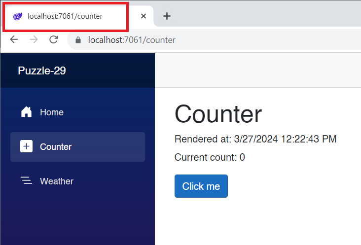

# Blazor Puzzle #29

## A Pre-Render Bender?

YouTube Video: 

BlazorPuzzle Home Page: https://blazorpuzzle.com

### The Challenge:

Carl and Jeff want to know how to deal with side-effects of turning off pre-rendering in a .NET 8 Blazor Web App in WebAssembly Interactive Render Mode where the Counter page is the only interactive page. When we turn pre-rendering off, the Page Title does not get set. 

*Counter.razor*:

```c#
@page "/counter"
@rendermode @(new InteractiveWebAssemblyRenderMode(false))

<PageTitle>Counter</PageTitle>

<h1>Counter</h1>
<h6>Rendered at:  @_RenderTime</h6>

<p role="status">Current count: @currentCount</p>

<button class="btn btn-primary" @onclick="IncrementCount">Click me</button>

@code {
	private int currentCount = 0;

	private DateTime _RenderTime = DateTime.UtcNow;

	private void IncrementCount()
	{
		currentCount++;
	}
}
```

Screen shot:



What's the solution?
