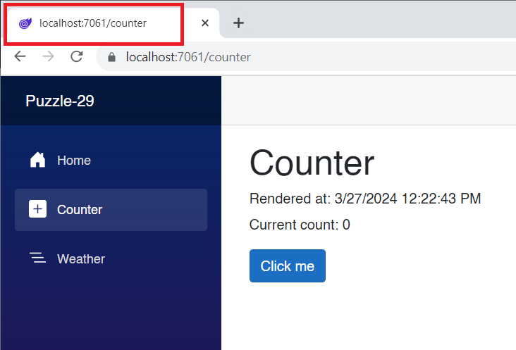
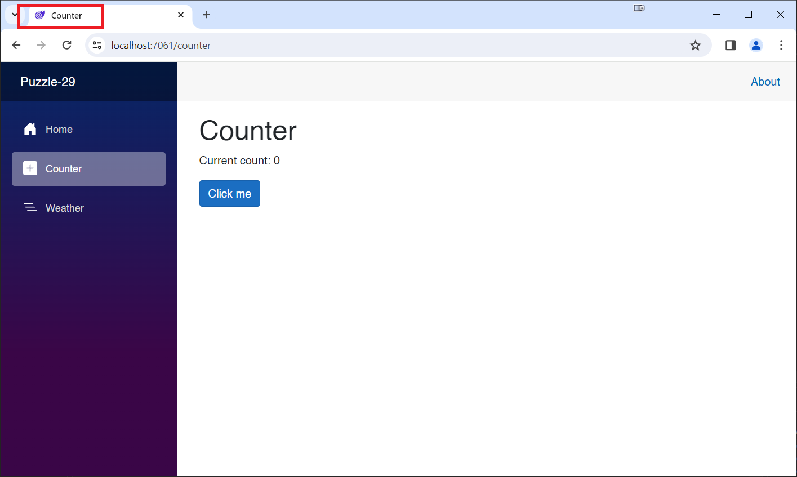

# Blazor Puzzle #29

## A Pre-Render Bender?

YouTube Video: https://youtu.be/7I3pbXFCyfM

BlazorPuzzle Home Page: https://blazorpuzzle.com

### The Challenge:

Carl and Jeff want to know how to deal with side-effects of turning off pre-rendering in a .NET 8 Blazor Web App in WebAssembly Interactive Render Mode where the Counter page is the only interactive page. When we turn pre-rendering off, the Page Title does not get set. 

*Counter.razor*:

```c#
@page "/counter"
@rendermode @(new InteractiveWebAssemblyRenderMode(false))

<PageTitle>Counter</PageTitle>

<h1>Counter</h1>
<h6>Rendered at:  @_RenderTime</h6>

<p role="status">Current count: @currentCount</p>

<button class="btn btn-primary" @onclick="IncrementCount">Click me</button>

@code {
	private int currentCount = 0;

	private DateTime _RenderTime = DateTime.UtcNow;

	private void IncrementCount()
	{
		currentCount++;
	}
}
```

Screen shot:



### The Solution:

The solution is to add a component with interactivity and pre-rendering set to false, and then call it from the `Counter` page.

Add the following to the **Puzzle-29-Client** project:

*_Counter.razor*:

```c#
@rendermode @(new InteractiveWebAssemblyRenderMode(false))

<p role="status">Current count: @currentCount</p>

<button class="btn btn-primary" @onclick="IncrementCount">Click me</button>

@code {
	private int currentCount = 0;

	private DateTime _RenderTime = DateTime.UtcNow;

	private void IncrementCount()
	{
		currentCount++;
	}
}
```

> Note that the name starts with an underscore 

Replace *Counter.razor* with the following:

```xml
@page "/counter"

<PageTitle>Counter</PageTitle>

<h1>Counter</h1>

<_Counter/>
```

Now run the app and note that the Title is correct:



The real issue here is that we've moved all the content that we do NOT want to be pre-rendered into a component, which we can call from a page that is pre-rendered by default. 

You can do this in your own projects, mixing and matching content based on pre-rendering.
